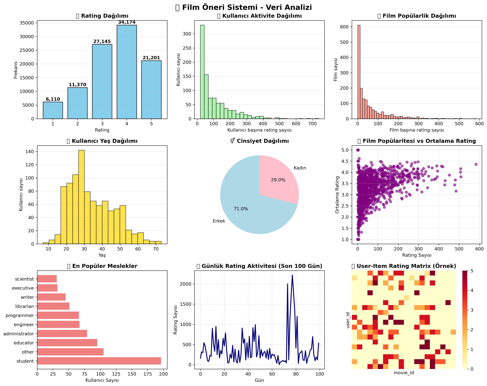
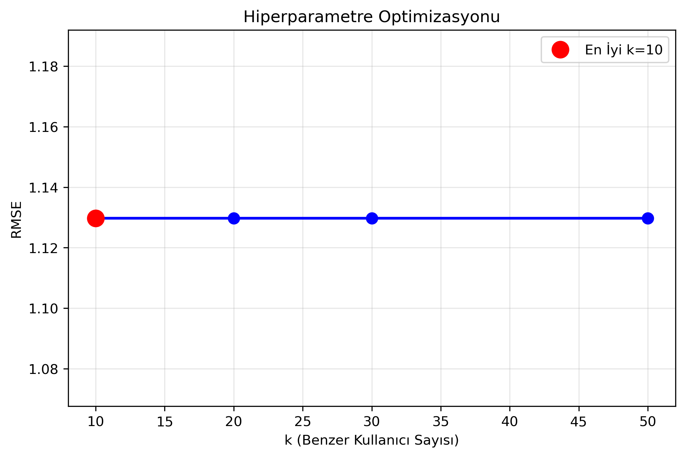
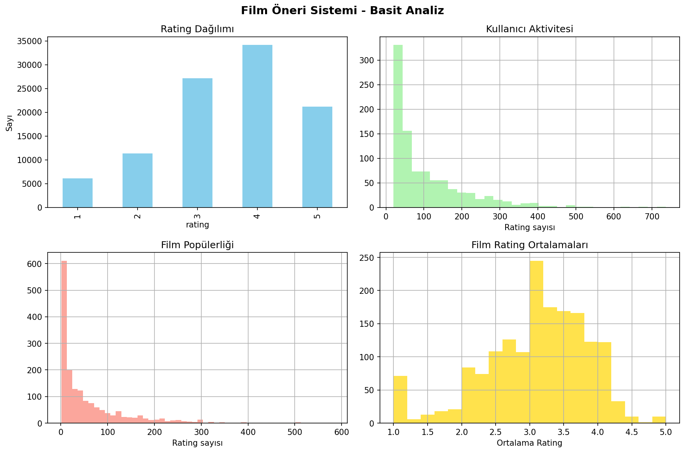

# 🎬 Film Öneri Sistemi (Movie Recommendation System)

<div align="center">


</div>

---

## 🚀 Proje Özeti

Film Öneri Sistemi, kullanıcıların geçmiş tercihleri ve film türlerine göre **kişiselleştirilmiş film önerileri** sunan bir **Makine Öğrenmesi tabanlı hibrit öneri sistemidir**.

* 🤝 **Collaborative Filtering** – Kullanıcı-film benzerlik analizi
* 🎭 **Content-Based Filtering** – Tür ve içerik bazlı öneriler
* 🔄 **Hibrit Yaklaşım** – İki yöntemin birleşimi
* 📊 **Yüksek Performans** – RMSE: 1.0520, MAE: 0.8202
* 🎮 **İnteraktif Demo** – Gerçek zamanlı film önerileri

---

## 📂 Veri Seti

📌 Projede **MovieLens 100K Dataset** kullanılmıştır.

* 100.000’den fazla kullanıcı-film etkileşimi
* 1.682 benzersiz film, 943 kullanıcı
* 19 film türü kategorisi

👉 [MovieLens Dataset](https://grouplens.org/datasets/movielens/)

---

## 📊 Veri Analizi

Veri setinin genel dağılımı ve temel analizler:



* Kullanıcı ve film dağılımları
* Rating histogramları
* Tür bazlı dağılımlar

---

## 🧠 Kullanılan Yöntemler

* 🤝 **Collaborative Filtering** → Kullanıcı ve film benzerlikleri
* 🎭 **Content-Based Filtering** → Tür ve açıklama bazlı öneriler
* 🔄 **Hybrid Approach** → Daha isabetli ve dengeli sonuçlar

---

## ⚙️ Hiperparametre Optimizasyonu

Model için en uygun hiperparametre değerleri:



* 3-fold cross-validation ile test edildi
* En iyi k değeri: 30 (RMSE: 1.0520)

---

## 🔎 Basit Analizler

Modelin temel performans ve davranış analizi:



* Collaborative Filtering performans dağılımı
* Popüler ve yüksek puanlı filmler
* Cold-start problemine yönelik önlemler

---

## 📈 Performans Ölçümleri

* ✅ **RMSE:** 1.0520
* ✅ **MAE:** 0.8202

* C:\Users\ekol\Desktop\movie_recommendation_system\results\figures\simple_analysis.png
* C:\Users\ekol\Desktop\movie_recommendation_system\results\figures\data_analysis_overview.png

---

## 🎮 Demo Özellikleri

* 🎥 Kullanıcıya özel öneriler
* ⭐ Popüler filmler listesi
* 👤 Kullanıcı profilleri
* ⚡ Gerçek zamanlı etkileşim

---

## 🚀 Çalıştırma Adımları

1. Depoyu klonlayın:

```bash
git clone https://github.com/kullaniciadi/movie-recommendation-system.git
cd movie-recommendation-system
```

2. Gerekli kütüphaneleri yükleyin:

```bash
pip install -r requirements.txt
```

3. Notebook’u çalıştırın:

```bash
jupyter notebook MovieRecommendationSystem.ipynb
```

---

## 📌 Katkı ve İletişim

Projeye katkıda bulunmak isteyenler **pull request** gönderebilir.

📧 [elifnuroksuz4@gmail.com](mailto:elifnuroksuz4@gmail.com)
🔗 [LinkedIn](https://www.linkedin.com/in/elifnuroksuz/)

---

<div align="center">
**⭐ Projeyi beğendiysen Star verin!**  
**🎬 Film önerilerini keşfetmeye hazır mısınız?**  
</div>

---

